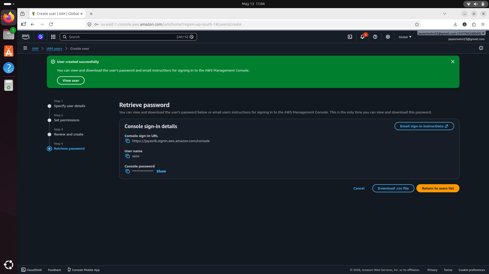

<section>
  <h2>What I Did</h2>
  

    I created a custom IAM policy that allows users to access only development
    EC2 instances.
  

  <h2>IAM Users and User Groups</h2>

  <h3>IAM User Groups</h3>
  

    IAM user groups help manage permissions for multiple users at once.
  

  

    Instead of assigning policies individually, policies can be attached
    directly to groups.
  

  <h3>IAM Users</h3>
  

    IAM users represent individuals who need access to AWS resources.
  

  

    In this project, I created an IAM user for interns and attached them to
    the development access group.
  

  <h2>Testing IAM Permissions</h2>

  <h3>Logging in as an IAM User</h3>
  

    I logged in using the IAM user credentials to test whether the policy
    worked correctly.
  

  <h3>Production Instance Testing</h3>
  

    When attempting to stop the production EC2 instance, access was denied
    because the policy only allows access to development resources.
  

  

    This demonstrates secure permission boundaries in AWS IAM.
  

  <h3>Development Instance Testing</h3>
  

    The IAM user was able to interact with the development EC2 instance
    because the correct resource tag matched the IAM policy condition.
  

</section>

