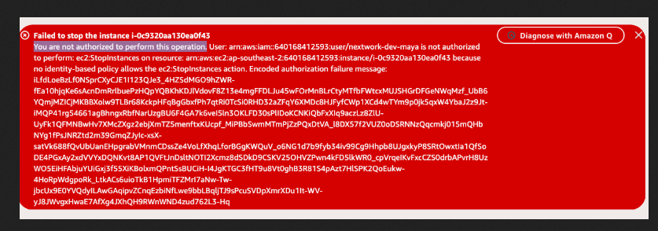
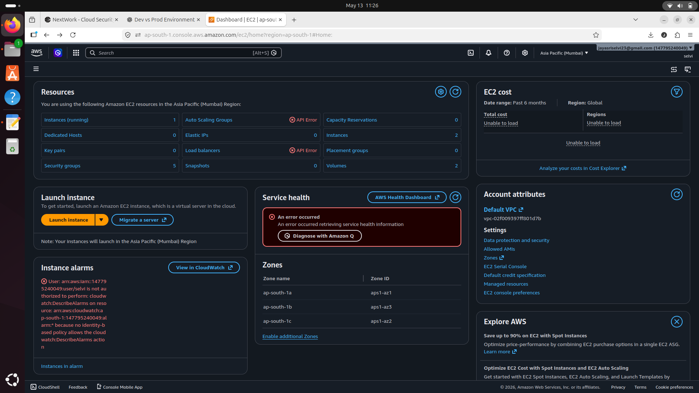

# Troubleshooting

<section>
  <h2>Problem</h2>
  

    While logged in as the IAM user, I received an <strong>Access Denied</strong> error
    when trying to stop or manage EC2 instances.
  

  <h2>Cause</h2>
  

    The IAM policy only allowed access to EC2 instances tagged with:
  

  <pre><code>"Env": "development"</code></pre>

  

    The production instance had a different tag value, so AWS automatically
    denied access.
  

  <h2>Solution</h2>
  
I verified the following:

  <ul>
    <li>The EC2 instance tags</li>
    <li>The IAM policy conditions</li>
    <li>The attached user group permissions</li>
  </ul>

  

    After checking the tag configuration, I understood why the production
    instance was restricted.
  

</section>

