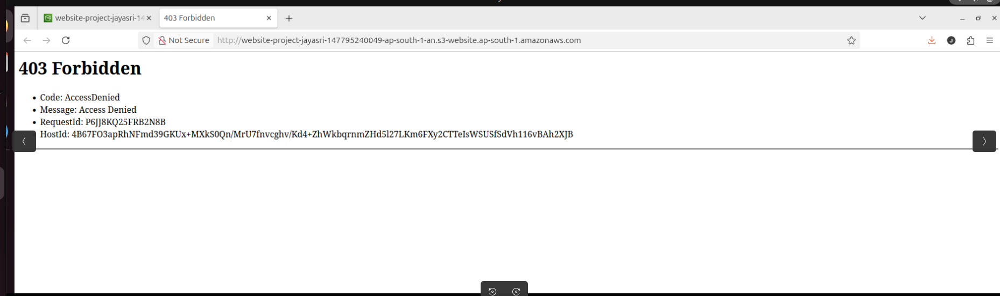

# Host a Website on Amazon S3

**Author:** Jayasri Selvi
**Email:** [jayasriselvi23@gmail.com](mailto:jayasriselvi23@gmail.com)

---

## Project Overview

In this project, I successfully hosted a static website using **Amazon S3 (Simple Storage Service)**. The goal was to learn how cloud storage can also be used for website hosting by uploading website files, configuring permissions, and making the site publicly accessible through the internet.

### AWS Services and Concepts Used

* Amazon S3
* Static Website Hosting
* Access Control Lists (ACLs)
* Bucket Policies
* Public Access Permission 

### Key Skills Learned

* Creating and configuring an S3 bucket
* Uploading website files and folders
* Enabling static website hosting
* Managing permissions using ACLs and bucket policies
* Troubleshooting access issues such as 403 Forbidden errors

### Project Duration

**Approximately 1 hour**

### Challenges Faced

The most challenging part was troubleshooting permission-related errors and correctly configuring public access.

### Project Outcome

Successfully deployed a fully functional static website hosted on Amazon S3.

---

## Step 1: Setting Up the S3 Bucket

I began by accessing Amazon S3 through the AWS Management Console and creating a new bucket to store my website files.

### Bucket Configuration

* **Region Selected:** Mumbai (ap-south-1)
* **Reason:** Chosen because it is geographically closer to my location, which can improve latency.

### Important Learning

S3 bucket names are globally unique, meaning each bucket name must be different from all existing S3 buckets worldwide.

### Time Taken

Creating the bucket took approximately **2 minutes**.

---

## Step 2: Uploading Website Files

Next, I uploaded the required website files into the bucket.

### Files Uploaded

* `index.html`
* Image/assets folder provided by NextWork

### Why These Files Matter

* `index.html` serves as the main webpage
* Asset folders contain images and supporting resources required for the website layout and design

This step ensured my website had all necessary content for proper display.

---

## Step 3: Enabling Static Website Hosting

After uploading files, I configured the bucket for static website hosting.

### What Website Hosting Means

Static website hosting allows files stored in S3 to be served as a public website over the internet.

### Configuration Steps

* Enabled static website hosting in bucket properties
* Specified `index.html` as the default homepage

### ACLs (Access Control Lists)

ACLs define who can access bucket objects. Enabling ACLs helped manage public access permissions for website files.

---

## Step 4: Testing the Bucket Endpoint

Once hosting was enabled, Amazon S3 generated a bucket website endpoint URL.

### Initial Result

When I first opened the endpoint, I encountered a **403 Forbidden** error.

### Reason for Error

Although hosting was enabled, the website files were still private due to restrictive permissions.

---

## Step 5: Fixing Permissions and Going Live

To make the website publicly accessible, I updated bucket permissions.

### Actions Taken

* Verified file names and structure
* Adjusted public access settings
* Configured bucket policy to allow public read access

### Final Result

The website became successfully accessible online.

---

## Bucket Policies

Bucket policies are JSON-based permission settings that define who can access bucket resources.

### My Bucket Policy Purpose

The policy allowed:

* Public read access to website files
* Website accessibility via browser
* Secure and controlled permissions for static hosting

### Example Use

This policy ensures users worldwide can view website content while maintaining administrative control.

---

## Final Reflection

This project gave me practical experience with foundational AWS cloud concepts and strengthened my understanding of:

* Cloud storage
* Web hosting
* Security permissions
* Troubleshooting deployment issues

### Overall Achievement

This project was an excellent hands-on introduction to AWS and cloud-based web deployment.

---

## Future Improvements

* Add CloudFront for faster global content delivery
* Use Route 53 for custom domain integration
* Implement HTTPS using AWS Certificate Manager
* Automate deployment using Terraform or CloudFormation

---

## Conclusion

Hosting a website on Amazon S3 is a cost-effective, scalable, and beginner-friendly way to understand cloud deployment. This project enhanced my practical AWS skills and provided valuable experience for future cloud and DevOps projects.
